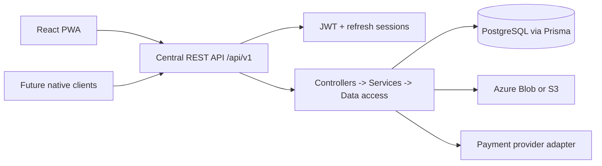

# Architecture

The system is multi-tenant by scope: College Admin access is constrained to assigned colleges/branches; Super Admin has organization scope. Student identity is the central `Student` record and `studentUid` is unique and immutable.
